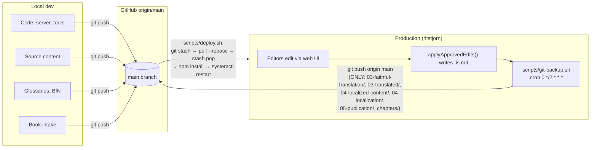

# Server Operations Guide

Daily operations for the `ritstjorn.namsbokasafn.is` server.

## Round-trip data flow

The repo is written from two sides — local dev and the production server — with GitHub as broker. Anyone debugging a deploy or wondering "why is there a dirty working tree on prod?" should read this section first.



Outbound from prod: `scripts/git-backup.sh` (cron every 2 h) commits `books/` content to `main`. Inbound to prod: `scripts/deploy.sh` with a `git stash` step that protects in-flight editor work from being clobbered by a pull.

Three rules that follow from this:

1. **Never run `git clean` or unrestricted `git checkout -- <path>` on production.** Anything inside the cron's six staging globs may be unpushed editor work that the next 2-hour tick would have pushed.
2. **Lockfile fixes belong on the dev side.** The cron does not touch `package*.json`, so any drift on `main` was pushed from dev — fix it there and let the next deploy pull it in.
3. **Book intake / large content imports must happen on dev**, then flow through GitHub to prod. Doing intake directly on prod leaves files outside the cron's globs — they sit untracked and risk being lost in a future cleanup.

## Starting and Stopping

```bash
# Start the service
sudo systemctl start ritstjorn

# Stop the service
sudo systemctl stop ritstjorn

# Restart the service
sudo systemctl restart ritstjorn

# Check service status
sudo systemctl status ritstjorn
```

## Viewing Logs

```bash
# Follow logs in real time
sudo journalctl -u ritstjorn -f

# Show last 50 lines
sudo journalctl -u ritstjorn -n 50

# Show logs since a specific time
sudo journalctl -u ritstjorn --since "2026-02-17 10:00"

# Show only errors
sudo journalctl -u ritstjorn -p err
```

## Database

### Location

```
<repo>/pipeline-output/sessions.db
```

SQLite database containing: users, workflow sessions, segment edits, module reviews, terminology, feedback, notifications.

### Backup

```bash
# Manual backup
cp pipeline-output/sessions.db pipeline-output/sessions.db.$(date +%Y%m%d)

# Check backup size
ls -lh pipeline-output/sessions.db*
```

### Running Migrations

Migrations run via the admin API endpoint (requires admin auth):

```bash
curl -X POST https://ritstjorn.namsbokasafn.is/api/admin/migrate \
  -H "Cookie: auth_token=<your-jwt>"
```

Or restart the server and trigger via the admin UI at `/admin`.

### Inspecting the Database

```bash
# Open SQLite CLI
sqlite3 pipeline-output/sessions.db

# List all tables
.tables

# Check row counts
SELECT 'segment_edits' as tbl, count(*) as cnt FROM segment_edits
UNION SELECT 'module_reviews', count(*) FROM module_reviews
UNION SELECT 'sessions', count(*) FROM sessions;

# Exit
.quit
```

## Health Check

```bash
# Check server is responding
curl -s https://ritstjorn.namsbokasafn.is/api/auth/me | head -c 100

# Check with local port (from server)
curl -s http://localhost:3000/api/auth/me | head -c 100
```

Expected response: `{"authenticated":false}` (when not logged in).

## Session Cleanup

Session cleanup runs automatically on server start. It removes:
- Zombie sessions (stuck in processing state)
- Stale sessions older than the configured threshold

No manual action needed. Check logs after restart to confirm cleanup ran.

## Common Issues

### Port 3000 Already in Use

```bash
# Find what's using port 3000
sudo lsof -i :3000

# If it's a stale node process, kill it
sudo kill <pid>

# Then restart the service
sudo systemctl restart ritstjorn
```

### SQLite Database Lock

If you see "database is locked" errors:

```bash
# Check for processes using the DB
sudo fuser pipeline-output/sessions.db

# Usually caused by a stuck migration or manual sqlite3 session
# Close any open sqlite3 sessions, then restart:
sudo systemctl restart ritstjorn
```

### OAuth Callback Mismatch

If login fails with "redirect_uri mismatch":

1. Check GitHub OAuth app settings at https://github.com/settings/developers
2. Verify callback URL matches: `https://ritstjorn.namsbokasafn.is/api/auth/callback`
3. Check `.env` file has matching `GITHUB_CALLBACK_URL`
4. Restart service after any `.env` changes

### nginx 502 Bad Gateway

A transient 502/503 lasting up to ~10 s during `sudo systemctl restart ritstjorn` is normal and not a deploy failure. The service takes 5–8 s to bind port 3000 because of better-sqlite3 startup and migration checks. `scripts/deploy.sh` polls the health endpoint for up to 30 s and only warns if it doesn't come up.

If the 502 persists past that, the Node.js service genuinely isn't running:

```bash
# Check if service is running
sudo systemctl status ritstjorn

# If not, start it
sudo systemctl start ritstjorn

# Check logs for crash reason
sudo journalctl -u ritstjorn -n 100
```

### SSL Certificate Renewal

Certbot auto-renews certificates. To check or force renewal:

```bash
# Check certificate expiry
sudo certbot certificates

# Force renewal (if needed)
sudo certbot renew --force-renewal
sudo systemctl reload nginx
```

## Deploying Updates

See [linode-deployment-checklist.md](linode-deployment-checklist.md), sections 10 and 11.

Quick version:
```bash
cd ~/repos/namsbokasafn-efni && git pull origin main
cd server && npm install
sudo systemctl restart ritstjorn
# Run migrations if needed (via admin endpoint)
sudo journalctl -u ritstjorn -n 50
```

---

*Last updated: February 2026*
