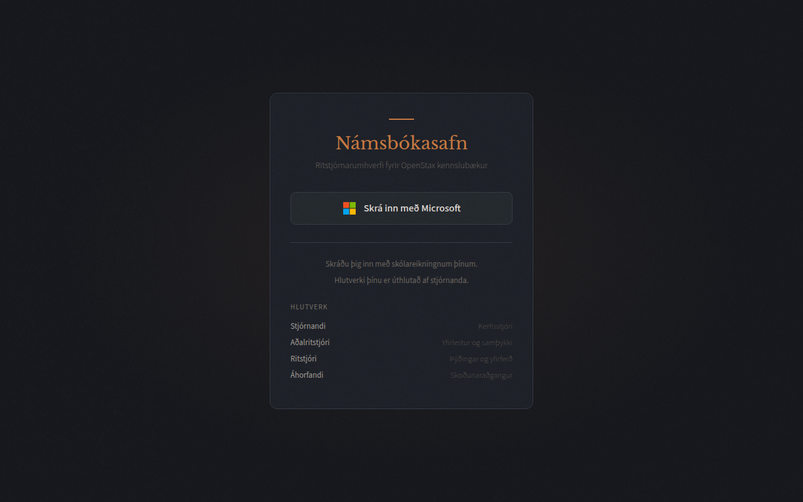
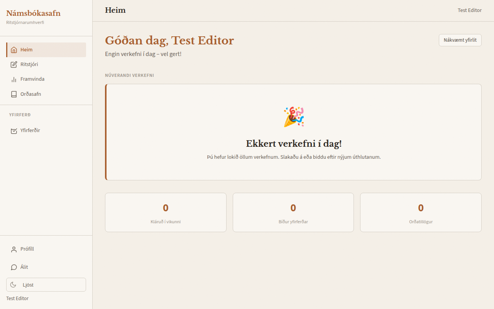
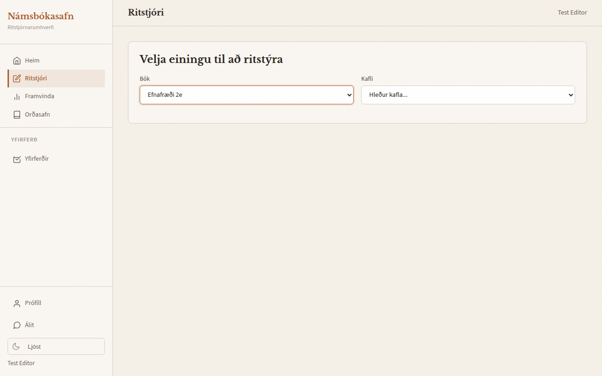
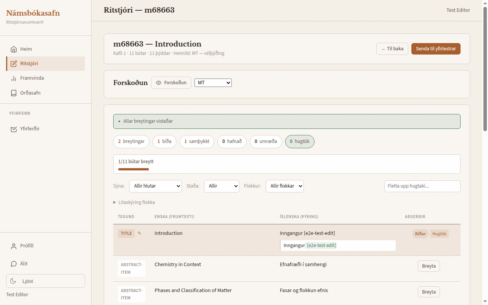
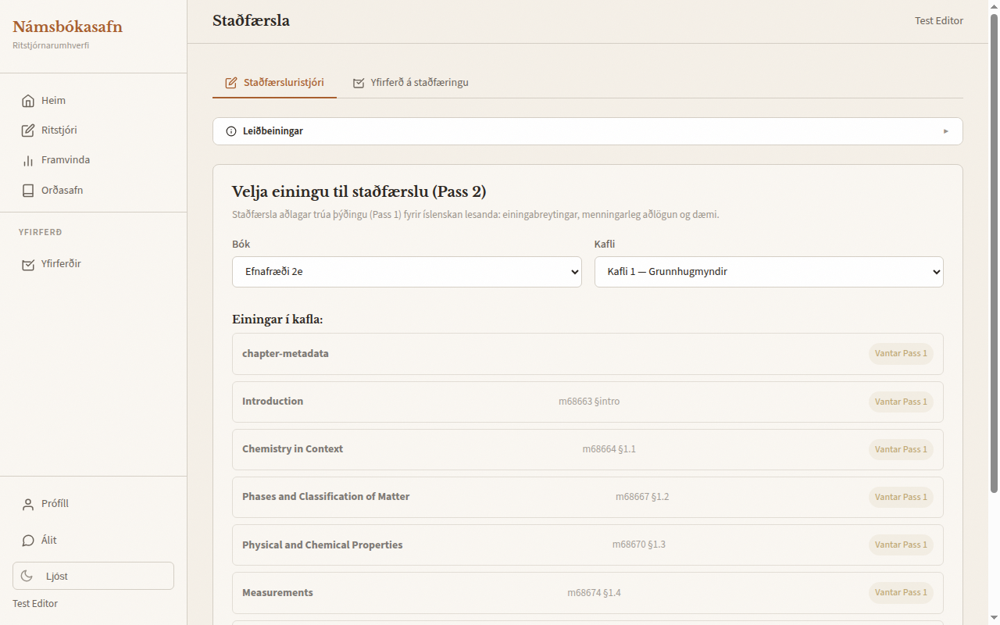
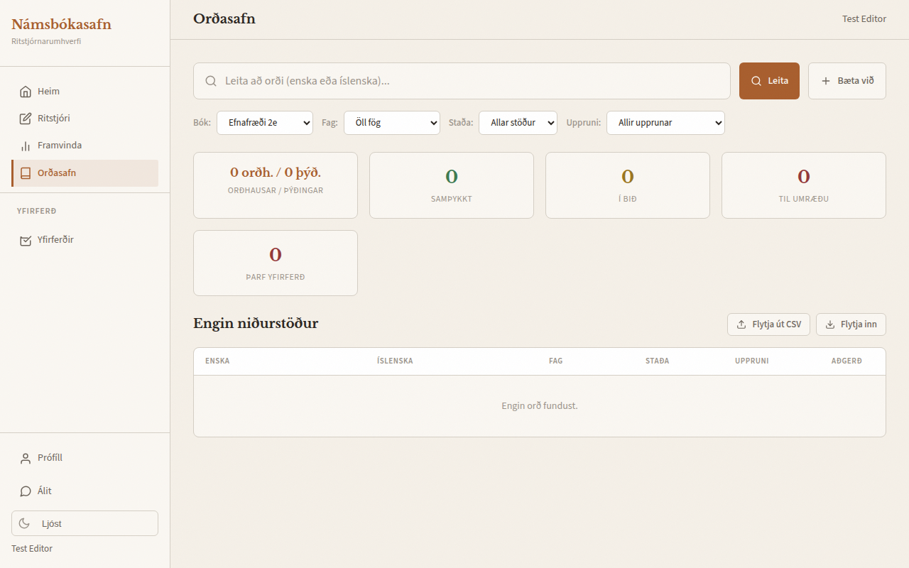
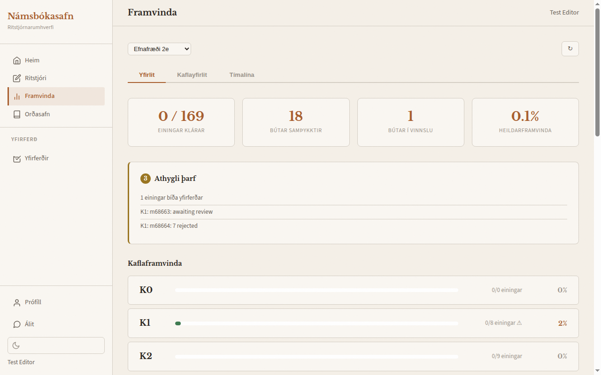
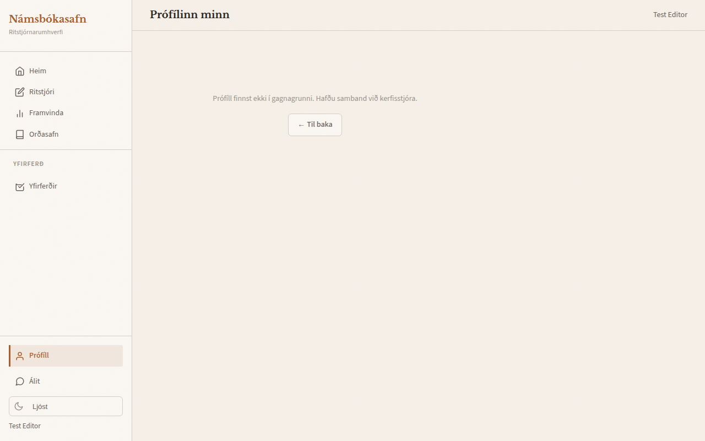
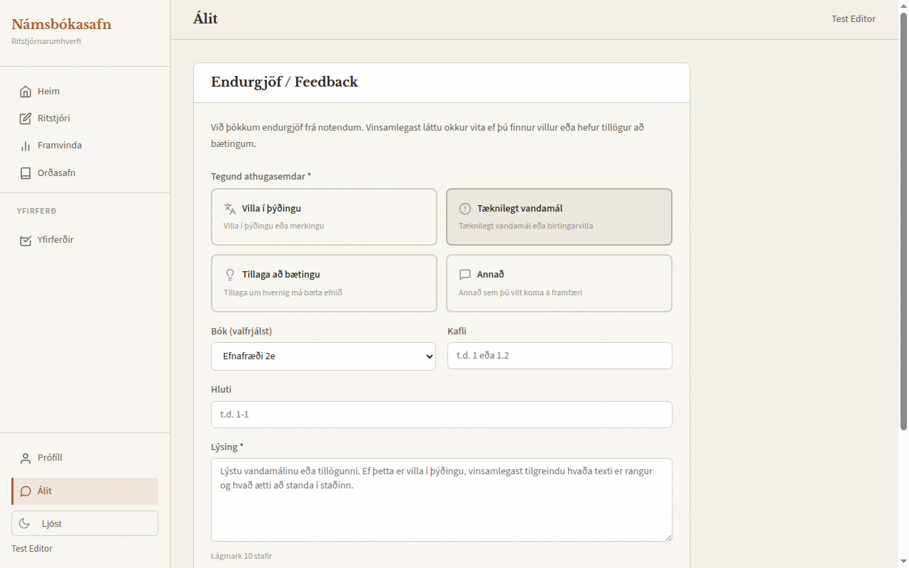

# Leiðbeiningar fyrir ritstjóra — Námsbókasafn

Velkomin í þýðingateymi Námsbókasafnsins! Þessar leiðbeiningar fara með þér yfir allt sem þú þarft að vita til að byrja að yfirfara og ritstýra þýðingum á OpenStax-kennslubókum yfir á íslensku.

> **Sjá einnig:** [Yfirlestur 1: Málfarsyfirlestur](../editorial/pass1-linguistic.md) og [Yfirlestur 2: Staðfærsla](../editorial/pass2-localization.md) fyrir nákvæmar leiðbeiningar um ritstýringu.

---

## 1. Til að byrja

### Hvað er Námsbókasafn?

Námsbókasafn er ritstjórnarvettvangur til að þýða opnar OpenStax-kennslubækur yfir á íslensku. Vinnuferlið hefur tvær yfirferðir:

| Yfirferð | Heiti | Tilgangur |
|---|---|---|
| **Yfirferð 1** | Málfarsleg yfirferð | Laga málfar, nákvæmni og hugtök í vélþýðingunni |
| **Yfirferð 2** | Staðfærsla | Aðlaga að íslenskum nemendum: breyta mælieiningum, skipta út menningartilvísunum, bæta við staðbundnu samhengi |

Þýðingarferlið er svona:

```
Vélþýðing → Yfirferð 1 (Nákvæm þýðing) → Yfirferð 2 (Staðfærð útgáfa)
```

### Þitt hlutverk sem ritstjóri

Sem ritstjóri getur þú:
- Lesið yfir og ritstýrt þýddum textaköflum (Yfirferð 1)
- Staðfært efni fyrir íslenska nemendur (Yfirferð 2)
- Flett upp og lagt til hugtök
- Fylgst með framvindu þinni í köflunum

### Að skrá sig inn

1. Farðu á ritstjórnarvefinn (umsjónarmaðurinn þinn gefur þér vefslóðina)
2. Þú munt sjá innskráningarsíðuna:



3. Smelltu á **„Skrá inn með Microsoft“**
4. Skráðu þig inn með Microsoft-skólaaðgangnum þínum
5. Eftir að innskráning hefur tekist ertu send/ur/t á stjórnborðið

> **Athugið:** Hlutverki þínu er úthlutað af umsjónarmanni. Ef þú hefur ekki aðgang að ákveðnum eiginleikum eftir innskráningu skaltu hafa samband við umsjónarmanninn þinn.

---

## 2. Viðmótið

### Mælaborð

Eftir innskráningu ferðu á heimasíðuna („Heim“). Þar birtist persónuleg kveðja og yfirlit yfir verkefni í bið.



Mælaborðið sýnir:
- **Verkefni í bið** sem þér hefur verið úthlutað
- **Tölfræði** sem sýnir ritunarvirkni þína (breytingar, yfirferðir, innsendingar)
- Flýtihlekki til að hefja næsta verkefni

### Leiðsagnarstika

Stikan vinstra megin er aðalleiðsögnin þín. Hlutar sem sjást fara eftir hlutverki þínu:

**Allir ritstjórar sjá:**
- **Heim** — Mælaborðið þitt
- **Ritstjóri** — Textaritillinn fyrir Pass 1
- **Framvinda** — Yfirlit yfir framvindu þýðinga
- **Orðasafn** — Hugtakagagnagrunnurinn

**Ritstjórar með yfirferðaraðgang sjá einnig:**
- **Yfirferðir** — Biðröð yfirferða
- **Staðfærsla** — Staðfærsluritillinn fyrir Pass 2

**Neðst:**
- **Prófíll** — Prófíllinn þinn
- **Álit** — Sendu inn álit um þýðingar
- **Þemaskiptir** — Skiptu á milli ljóss og dökkrar stillingar

---

## 3. Pass 1: Ritstjóri hluta (Málfræðileg yfirferð)

Þú munt eyða mestum tíma þínum í ritstjóra hluta. Hann sýnir staka textahluta (málsgreinar, fyrirsagnir, atriði í listum) svo þú getir farið yfir vélþýðinguna og leiðrétt villur.

> **Markmið:** Að búa til *trúa þýðingu* — eðlilega, nákvæma íslensku sem endurspeglar frumtextann náið. EKKI staðfæra (það er gert í Pass 2).

### Velja einingu

1. Farðu í **Ritstjóri** á hliðarstikunni
2. Veldu **bók** úr fellilistanum (t.d. „Efnafræði 2e“ fyrir Chemistry)
3. Veldu **kafla**
4. Þú munt sjá lista yfir einingar í kaflanum — smelltu á eina til að hefja ritun



Hver eining sýnir stöðumerki:
- **EN** — Enskir frumtextahlutar eru til staðar
- **MT** — Vélþýðing er tiltæk

### Ritun hluta

Eftir að smellt er á einingu hleður ritstjórinn inn öllum hlutum í tveggja dálka uppsetningu:



- **Vinstri dálkur:** Enskur frumtexti (ekki hægt að breyta)
- **Hægri dálkur:** Íslensk þýðing (hægt að breyta)

Verkfærastikan efst gerir þér kleift að sía hluta eftir stöðu (allir, ritstýrðir, óritstýrðir o.s.frv.).

**Til að breyta hluta:**

1. Smelltu á íslenska textann til að gera hann breytanlegan
2. Gerðu leiðréttingu þína
3. Veldu **flokk** fyrir breytinguna þína:
   - **terminology** — Skipt um hugtak eða stöðlun
   - **accuracy** — Staðreyndaleiðrétting eða lagfæring á rangþýðingu
   - **readability** — Málfar, stafsetning eða skýrleikabætur
   - **style** — Tónn eða stíllagaðlögun
   - **omission** — Bætt við efni sem vantaði
4. Þú getur einnig bætt við **athugasemd ritstjóra** til að útskýra breytinguna þína
5. Breytingin þín er vistuð sjálfkrafa

### Hvað á að laga (og hvað ekki)

| Gera | Ekki gera |
|----|--------|
| Laga málfar og stafsetningu | Breyta einingum (mílur, Fahrenheit o.s.frv.) |
| Bæta orðaval til að auka skýrleika | Breyta menningartengdum tilvísunum |
| Tryggja eðlilega íslensku | Bæta við íslenskum dæmum |
| Athuga samræmi í hugtakanotkun | Fjarlægja eða bæta við efni |
| Staðfesta tæknilega nákvæmni | Staðfæra nokkuð |

### Senda til yfirferðar

Þegar þú hefur farið yfir alla hluta í einingu:

1. Smelltu á **„Senda til yfirferðar“**
2. Breytingarnar þínar fara til yfirritstjóra til samþykktar
3. Þú getur fylgst með innsendingum í gegnum **Yfirferðir** á hliðarstikunni

Yfirritstjórinn mun þá:
- **Samþykkja** breytinguna þína
- **Hafna** henni (með endurgjöf sem útskýrir hvers vegna)
- **Merkja til umræðu** — opnar athugasemdaþráð þar sem þú getur svarað

---

## 4. Áfangi 2: Staðfærsluritstjóri

Eftir að áfangi 1 skilar af sér nákvæmri þýðingu er hún aðlöguð fyrir íslenska nemendur í áfanga 2. Þetta er sérstakur ritstjóri sem er hannaður fyrir menningarlega aðlögun.

### Opna staðfærsluritstjórann

1. Farðu í **Staðfærsla** í hliðarstikunni
2. Veldu bók og kafla
3. Smelltu á einingu til að byrja



Staðfærsluritstjórinn hefur tvo flipa efst:
- **Staðfærsluritstjóri** — Ritstjóraviðmót
- **Yfirferð á staðfæringu** — Yfirferðarbiðröð fyrir staðfæringarbreytingar

Þar er einnig hnappurinn **Leiðbeiningar** sem stækkar tilvísanaspjald.

### Þriggja dálka útlit

Þegar eining er hlaðin sýnir ritstjórinn þrjá dálka:
- **Vinstri:** Enskur frumtexti (tilvísun)
- **Miðja:** Nákvæm íslensk þýðing úr áfanga 1 (skrifvarin)
- **Hægri:** Staðfærð útgáfa (breytanleg)

### Tegundir staðfæringar

Hver breyting er flokkuð:

| Flokkur | Dæmi |
|---|---|
| **einingabreyting** | Fahrenheit → Selsíus, mílur → km |
| **menningarleg-aðlögun** | Bandarískir frídagar → íslensk samsvörun |
| **dæmaskipti** | Dæmi sem eiga sérstaklega við í Bandaríkjunum → staðbundið samhengi |
| **snið** | Stílbreytingar fyrir íslenskar venjur |
| **óbreytt** | Textabútur þarfnast engrar staðfæringar |

### Vista vinnu

- Vistaðu staka textabúta jafnóðum
- Notaðu **„Vista allt“** til að vista allar breytingar í einu

---

## 5. Orðasafn

### Hugtakagagnagrunnurinn

Farðu í **Orðasafn** á hliðarstikunni til að skoða, leita og umsýsla þýðingarhugtök.



Orðasafnssíðan býður upp á:
- **Leitarstiku** — Leitaðu eftir ensku eða íslensku hugtaki
- **Síur** — Síaðu eftir efnisflokki (efnafræði, líffræði o.s.frv.), bók eða stöðu
- **Tölfræði** — Heildarfjöldi hugtaka, samþykkt, ágreiningur og þarfnast yfirlestrar
- **Hugtakatafla** — Sýnir enskt hugtak, íslenska þýðingu, efnisflokk og stöðu

### Leit að hugtökum

1. Sláðu inn enska eða íslenska hugtakið í leitarstikuna
2. Síaðu að vild eftir efnisflokki eða stöðu
3. Smelltu á **„Leita“**

### Að leggja til ný hugtök

Ef þú rekst á hugtak sem er ekki í orðasafninu:

1. Smelltu á **„Bæta við“**
2. Sláðu inn enska hugtakið og þína tillögu að íslenskri þýðingu
3. Bættu við athugasemdum til að útskýra val þitt
4. Sendu til samþykktar hjá yfirritstjóra (Head Editor)

### Orðasafn í textaritlinum

Þegar textaeiningar eru rýndar í Pass 1 býður ritillinn upp á leit í orðasafni. Þú getur leitað að hugtökum beint úr ritilsviðmótinu án þess að fara af síðunni.

---

## 6. Fylgjast með framvindu

Síðan **Framvinda** gefur þér yfirlit yfir framvindu þýðinga í öllum köflum.



Síðan sýnir:
- **Yfirlitstölfræði** — Heildarfjöldi eininga, ritstýrt, samþykkt og hlutfall verkloka
- **Athygli krafist** — Kaflar sem þarfnast athygli eða eru stopp vegna vandamála
- **Kaflalisti** — Hver kafli með framvindustiku sem sýnir hversu langt ritstýringin er komin

Smelltu á kafla til að sjá nánari upplýsingar og stöðu einstakra eininga.

---

## 7. Aðrar síður

### Prófíll

Farðu á **Prófíll** til að sjá reikningsupplýsingarnar þínar: nafn, netfang, hlutverk og virkniferil.



### Álit

Síðan **Álit** er opið eyðublað til að tilkynna um þýðingarvillur eða leggja til úrbætur á birtu efni.



Þú getur sent inn álit um:
- Þýðingarvillur í birtu efni
- Tillögur að hugtökum
- Almennar athugasemdir

---

## 8. Ábendingar og úrræðaleit

### „Ég veit ekki hvernig ég á að þýða þetta hugtak“

1. Flettu upp í hugtakagrunninum í **Orðasafni**
2. Ef það finnst ekki, leggðu til nýtt hugtak
3. Bættu við athugasemd ritstjóra við textaeininguna þar sem þú útskýrir óvissuna

### „Vélþýðingin er mjög röng“

Það er viðbúið! Þitt hlutverk er að laga hana. Ekki hika við að endurskrifa heilar setningar ef þörf krefur. Flokkaðu breytinguna sem **nákvæmni** eða **læsileika**.

### „Ég fann villu í uppbyggingu eða sniði“

- Ef hún er í þýðingartextanum, lagaðu hana og flokkaðu sem **læsileika**
- Ef það er birtingarvandamál (brotið útlit, myndir vantar), tilkynntu það til kerfisstjóra

### „Ég er ósammála fyrri ákvörðun um hugtak“

- Fylgdu gildandi ákvörðun til að tryggja samræmi
- Komdu málinu á framfæri við yfirritstjóra til umræðu
- Ekki breyta viðurkenndum hugtökum án samþykkis

### Að fá hjálp

1. **Spurningar um þýðingar** — Bættu við athugasemd ritstjóra við textaeininguna
2. **Spurningar um hugtök** — Leggðu til hugtak í **Orðasafni**
3. **Tæknileg vandamál** — Hafðu samband við kerfisstjóra
4. **Almennar spurningar** — Berðu þær upp á teymisfundi

---

## Flýtileiðbeiningar

| Verkefni | Hvert á að fara |
|---|---|
| Breyta þýðingum (yfirferð 1) | **Ritstjóri** |
| Staðfæra efni (yfirferð 2) | **Staðfærsla** |
| Fletta upp / stinga upp á hugtökum | **Orðasafn** |
| Athuga framvindu | **Framvinda** |
| Senda inn álit | **Álit** |
| Skoða prófílinn þinn | **Prófíll** |

---

*Velkomin í teymið! Ekki hika við að spyrja spurninga – við erum öll að læra saman.*